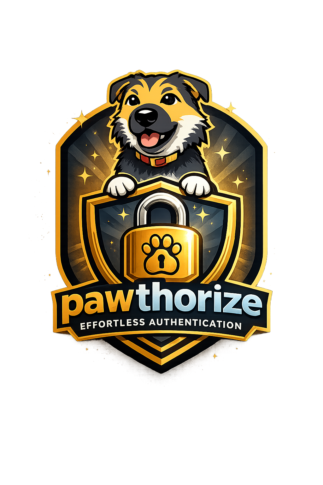

<div align="center">
  

  # Pawthorize

  **Modern, production-ready authentication for ASP.NET Core** - batteries included.

  [](https://www.nuget.org/packages/Pawthorize)
  [](https://opensource.org/licenses/MIT)
  []()

  **Latest:** v1.0.0 - Consistent error responses across all endpoints

  [Quick Start](#quick-start) • [Features](#features) • [Documentation](#documentation) • [Examples](#examples) • [Troubleshooting](#troubleshooting)
</div>

---

## 📦 What is Pawthorize?

Pawthorize is a complete, production-ready authentication library for ASP.NET Core that handles everything from user registration to OAuth 2.0 social login. Built for **Minimal APIs** and designed to get you from zero to secure authentication in minutes, not hours.

**Stop writing boilerplate auth code.** Pawthorize provides a secure, tested, and extensible foundation so you can focus on building your application.

### 🎯 Perfect For
- ✅ **New projects** that need authentication fast
- ✅ **Minimal API** applications (though it works with MVC too)
- ✅ **SPAs** (React, Vue, Angular) with JWT auth
- ✅ Projects requiring **OAuth 2.0** social login
- ✅ Apps with **session management** needs

---

## ✨ Features

### Core Authentication
- ✅ **User Registration & Login** - Email/password with BCrypt hashing and structured names (FirstName/LastName)
- ✅ **JWT Token Management** - Access + refresh tokens with automatic rotation
- ✅ **Remember Me** - Configurable session persistence
- ✅ **Password Reset Flow** - Secure token-based password recovery
- ✅ **Email Verification** - Optional email confirmation workflow
- ✅ **Email Change** - Secure email address change with verification
- ✅ **Session Management** - View and revoke active sessions across devices
- ✅ **Account Security** - Account locking, email verification requirements

### OAuth 2.0 Social Login
- ✅ **Google OAuth** - Sign in with Google (extracts given_name/family_name)
- ✅ **Discord OAuth** - Sign in with Discord (extracts username as FirstName)
- ✅ **Structured Name Support** - OAuth providers automatically populate FirstName/LastName
- ✅ **Account Linking** - Connect multiple OAuth providers to one account
- ✅ **Auto-Registration** - Automatically create accounts on first OAuth login
- ✅ **PKCE Support** - Enhanced security for OAuth flows (RFC 7636)
- ✅ **Extensible** - Easy to add more providers (GitHub, Facebook, etc.)

### Security
- ✅ **CSRF Protection** - Double Submit Cookie pattern with automatic token rotation
- ✅ **Secure Password Hashing** - BCrypt with automatic salting
- ✅ **Password Policy** - Configurable password strength requirements
- ✅ **Account Lockout** - Brute force protection with failed attempt tracking
- ✅ **Rate Limiting** - Built-in configurable rate limiting for all endpoints
- ✅ **Token Expiration** - Configurable TTLs for all tokens
- ✅ **Constant-Time Comparisons** - Protection against timing attacks
- ✅ **OAuth State Validation** - CSRF protection for OAuth flows

### Developer Experience
- ✅ **Enhanced Error Messages (v0.7.1+)** - Detailed JWT error diagnostics in Development mode
- ✅ **Detailed Validation Errors (v0.7.2+)** - Field-level validation errors with clear messages
- ✅ **Comprehensive Logging** - `[Pawthorize JWT]` prefixed logs at every authentication step
- ✅ **Flexible Token Delivery** - Cookies, response body, or hybrid strategies
- ✅ **Role-Based Authorization** - Automatic role claims in JWT (you manage roles)
- ✅ **Customizable Endpoints** - Custom paths or manual endpoint mapping
- ✅ **Integrated Error Handling** - ErrorHound integration for consistent API responses
- ✅ **OpenAPI/Swagger Support** - Automatic API documentation
- ✅ **FluentValidation** - Request validation out of the box
- ✅ **Extensible Architecture** - Easy to customize every aspect

---

## 🚀 Quick Start

### 1. Install Pawthorize

```bash
dotnet add package Pawthorize
```

### 2. Define Your User Model

```csharp
public class User : IAuthenticatedUser
{
    public string Id { get; set; } = Guid.NewGuid().ToString();
    public string Email { get; set; } = string.Empty;
    public string PasswordHash { get; set; } = string.Empty;
    public string FirstName { get; set; } = string.Empty;
    public string LastName { get; set; } = string.Empty;
    public IEnumerable<string> Roles { get; set; } = new List<string>();
    public IDictionary<string, string>? AdditionalClaims { get; set; }
    public bool IsEmailVerified { get; set; }
    public bool IsLocked { get; set; }
    public DateTime? LockedUntil { get; set; }

    // Account lockout properties
    public int FailedLoginAttempts { get; set; } = 0;
    public DateTime? LockoutEnd { get; set; }
}
```

### 3. Implement Required Repositories

Pawthorize uses the repository pattern for data persistence. You need to implement:

```csharp
// User storage (Entity Framework, Dapper, etc.)
public class UserRepository : IUserRepository<User>
{
    public Task<User?> FindByEmailAsync(string email, CancellationToken ct) { /* ... */ }
    public Task<User?> FindByIdAsync(string id, CancellationToken ct) { /* ... */ }
    public Task CreateAsync(User user, CancellationToken ct) { /* ... */ }
    public Task UpdateAsync(User user, CancellationToken ct) { /* ... */ }
}

// Refresh token storage (v0.7.4+: includes device info, IP address, and remember me)
public class RefreshTokenRepository : IRefreshTokenRepository
{
    public Task StoreAsync(string tokenHash, string userId, DateTime expiresAt,
        string? deviceInfo = null, string? ipAddress = null,
        bool isRememberedSession = false, CancellationToken ct = default) { /* ... */ }
    public Task<RefreshTokenInfo?> ValidateAsync(string tokenHash, CancellationToken ct) { /* ... */ }
    public Task RevokeAsync(string tokenHash, CancellationToken ct) { /* ... */ }
    public Task UpdateLastActivityAsync(string tokenHash, DateTime lastActivityAt, CancellationToken ct) { /* ... */ }
    // ... other methods
}

// User factory for creating users from registration
public class UserFactory : IUserFactory<User, RegisterRequest>
{
    public User CreateUser(RegisterRequest request, string passwordHash)
    {
        return new User
        {
            Email = request.Email,
            PasswordHash = passwordHash,
            FirstName = request.FirstName,
            LastName = request.LastName
        };
    }
}
```

**💡 Tip:** Check the [sample app](samples/Pawthorize.Sample.MinimalApi) for complete in-memory implementations.

### 4. Configure Pawthorize

**appsettings.json:**
```json
{
  "Pawthorize": {
    "RequireEmailVerification": false,
    "TokenDelivery": "Hybrid",
    "LoginIdentifier": "Email",
    "Csrf": {
      "Enabled": true
    },
    "PasswordPolicy": {
      "MinLength": 8,
      "MaxLength": 128,
      "RequireUppercase": true,
      "RequireLowercase": true,
      "RequireDigit": true,
      "RequireSpecialChar": true,
      "BlockCommonPasswords": true
    },
    "AccountLockout": {
      "Enabled": true,
      "MaxFailedAttempts": 5,
      "LockoutMinutes": 30,
      "ResetOnSuccessfulLogin": true
    },
    "RateLimiting": {
      "Enabled": true,
      "PermitLimit": 100,
      "WindowMinutes": 1
    }
  },
  "Jwt": {
    "Secret": "your-super-secret-jwt-key-at-least-32-characters-long",
    "Issuer": "YourApp",
    "Audience": "YourApp.Users",
    "AccessTokenLifetimeMinutes": 15,
    "RefreshTokenLifetimeDaysRemembered": 30,
    "RefreshTokenLifetimeHoursDefault": 24,
    "UseSessionCookieWhenNotRemembered": false
  }
}
```

**Program.cs:**
```csharp
var builder = WebApplication.CreateBuilder(args);

// Add Pawthorize services
builder.Services.AddPawthorize<User>(options =>
{
    options.UseConfiguration(builder.Configuration);
    options.UseDefaultFormatters();
});

// Register your repositories
builder.Services.AddScoped<IUserRepository<User>, UserRepository>();
builder.Services.AddScoped<IRefreshTokenRepository, RefreshTokenRepository>();
builder.Services.AddScoped<IUserFactory<User, RegisterRequest>, UserFactory>();

var app = builder.Build();

// Use Pawthorize middleware (ErrorHound, CSRF, Authentication)
app.UsePawthorize();

// Map all Pawthorize endpoints
app.MapPawthorize();

app.Run();
```

**That's it!** You now have a complete authentication system with 13+ endpoints:

- `POST /api/auth/register` - Register new user
- `POST /api/auth/login` - Login with email/password
- `POST /api/auth/refresh` - Refresh access token
- `POST /api/auth/logout` - Logout (revoke refresh token)
- `POST /api/auth/forgot-password` - Request password reset
- `POST /api/auth/reset-password` - Reset password with token
- `POST /api/auth/change-password` - Change password (requires auth)
- `POST /api/auth/set-password` - Set password for OAuth-only users (v0.7.9+)
- `POST /api/auth/change-email` - Request email change (v0.8.0+)
- `GET /api/auth/verify-email-change` - Verify new email address (v0.8.0+)
- `GET /api/auth/me` - Get current user info (includes `hasPassword` v0.7.9+)
- `GET /api/auth/sessions` - Get active sessions with device info (v0.7.2+)
- `POST /api/auth/sessions/revoke-others` - Revoke other sessions
- `POST /api/auth/sessions/revoke` - Revoke specific session (v0.7.2+)

### 5. Quick Start: Add OAuth (Optional)

Want social login? Add OAuth in minutes:

```csharp
// Program.cs - Add to your AddPawthorize configuration
builder.Services.AddPawthorize<User>(options =>
{
    options.UseConfiguration(builder.Configuration);
    options.UseDefaultFormatters();

    // Enable OAuth providers
    options.AddGoogle();
    options.AddDiscord();
});

// Register OAuth repository
builder.Services.AddScoped<IExternalAuthRepository<User>, ExternalAuthRepository>();
```

**appsettings.json:**
```json
{
  "Pawthorize": {
    "OAuth": {
      "AllowAutoRegistration": true,
      "UsePkce": true,
      "Providers": {
        "Google": {
          "Enabled": true,
          "ClientId": "YOUR_CLIENT_ID.apps.googleusercontent.com",
          "ClientSecret": "YOUR_CLIENT_SECRET",
          "RedirectUri": "http://localhost:5000/api/auth/oauth/google/callback"
        }
      }
    }
  }
}
```

**Frontend:**
```html
<button onclick="window.location.href='/api/auth/oauth/google'">
  Sign in with Google
</button>
```

**OAuth endpoints:**
- `GET /api/auth/oauth/{provider}` - Initiate OAuth flow
- `GET /api/auth/oauth/{provider}/callback` - OAuth callback handler
- `POST /api/auth/oauth/{provider}/link` - Link provider to account
- `DELETE /api/auth/oauth/{provider}/unlink` - Unlink provider
- `GET /api/auth/oauth/linked` - List linked providers

---

## 📚 Documentation

### Token Delivery Strategies

Pawthorize supports three token delivery strategies:

#### 1. **ResponseBody** (Default for APIs)
```json
{
  "accessToken": "eyJhbGci...",
  "refreshToken": "def50200...",
  "tokenType": "Bearer",
  "expiresAt": "2024-01-15T10:30:00Z"
}
```

Best for: SPAs, mobile apps, third-party API consumers

#### 2. **HttpOnlyCookies** (Most Secure)
- Tokens stored in HttpOnly, Secure, SameSite cookies
- No response body tokens
- Automatic cookie authentication
- Best XSS protection

Best for: Server-rendered apps, same-origin SPAs

#### 3. **Hybrid** (Recommended for SPAs)
- Access token in response body
- Refresh token in HttpOnly cookie
- Balance of security and convenience

Best for: SPAs that need access token in JavaScript but want secure refresh

**Configure in appsettings.json:**
```json
{
  "Pawthorize": {
    "TokenDelivery": "Hybrid"  // or "ResponseBody" or "HttpOnlyCookies"
  }
}
```

### CSRF Protection

When using cookies (`Hybrid` or `HttpOnlyCookies`), Pawthorize automatically enables CSRF protection using the Double Submit Cookie pattern.

**How it works:**
1. On login/register, server generates a CSRF token
2. Token sent in both a cookie and response header
3. Client stores token and sends in `X-XSRF-TOKEN` header
4. Server validates token matches cookie

**Client implementation (JavaScript):**
```javascript
// After login, extract CSRF token
const csrfToken = response.headers.get('X-XSRF-TOKEN');
localStorage.setItem('csrfToken', csrfToken);

// Include in subsequent requests
fetch('/api/auth/logout', {
  method: 'POST',
  headers: {
    'X-XSRF-TOKEN': localStorage.getItem('csrfToken')
  },
  credentials: 'include' // Include cookies
});
```

### Role-Based Authorization

Pawthorize automatically adds roles from `IAuthenticatedUser.Roles` to JWT claims. You manage roles yourself:

```csharp
// Your User class
public class User : IAuthenticatedUser
{
    public string Id { get; set; }
    public string Email { get; set; }
    public string PasswordHash { get; set; }
    public string FirstName { get; set; }
    public string LastName { get; set; }

    // Populate this property based on your role system
    public IEnumerable<string> Roles { get; set; } = new List<string>();

    // ... other properties
}

// When creating/updating users, set their roles
var user = new User
{
    Email = "admin@example.com",
    FirstName = "Admin",
    LastName = "User",
    Roles = new List<string> { "Admin", "Manager" } // Your role management logic
};

// Roles automatically added to JWT claims

// Protect endpoints using standard ASP.NET Core authorization
app.MapGet("/admin/users", () => { /* ... */ })
   .RequireAuthorization(policy => policy.RequireRole("Admin"));
```

**Note:** Pawthorize does not include role management features (creating roles, assigning roles to users). You implement role storage and management in your application, and Pawthorize will include them in JWT tokens.

### Endpoint Customization

Pawthorize offers flexible endpoint mapping options:

#### Option 1: Automatic Mapping (Default)

```csharp
// Maps all endpoints to /api/auth/*
app.MapPawthorize();
```

#### Option 2: Custom Base Path

```csharp
app.MapPawthorize(options =>
{
    options.BasePath = "/myapp/v1/auth";  // Changes base from /api/auth
    options.LoginPath = "/signin";         // Optional: customize individual paths
    options.RegisterPath = "/signup";
});

// Results in: /myapp/v1/auth/signin, /myapp/v1/auth/signup, etc.
```

#### Option 3: Manual Mapping (Full Control)

```csharp
var authGroup = app.MapGroup("/myapp/v1/auth");

// Map only the endpoints you need with custom policies
authGroup.MapPawthorizeLogin<User>()
    .RequireRateLimiting("auth");

authGroup.MapPawthorizeRegister<User, RegisterRequest>()
    .RequireRateLimiting("auth");

authGroup.MapPawthorizeRefresh<User>();
authGroup.MapPawthorizeLogout<User>();

// Available methods:
// - MapPawthorizeLogin<TUser>()
// - MapPawthorizeRegister<TUser, TRegisterRequest>()
// - MapPawthorizeRefresh<TUser>()
// - MapPawthorizeLogout<TUser>()
// - MapPawthorizeOAuth<TUser>() (if OAuth enabled)
```

### Custom Claims

```csharp
public class User : IAuthenticatedUser
{
    // ... other properties

    public IDictionary<string, string>? AdditionalClaims => new Dictionary<string, string>
    {
        ["department"] = "Engineering",
        ["tenant_id"] = "acme-corp"
    };
}

// Claims automatically added to JWT
// Access in endpoints: context.User.FindFirst("department")?.Value
```

### Email Verification

```csharp
// Enable in configuration
{
  "Pawthorize": {
    "RequireEmailVerification": true,
    "EmailVerification": {
      "BaseUrl": "https://yourapp.com",
      "TokenLifetimeMinutes": 1440
    }
  }
}

// Implement IEmailSender
public class EmailSender : IEmailSender
{
    public async Task SendEmailAsync(string to, string subject, string body, CancellationToken ct)
    {
        // Send email via SendGrid, AWS SES, etc.
    }
}

// Register
builder.Services.AddScoped<IEmailSender, EmailSender>();
builder.Services.AddScoped<IEmailVerificationService, EmailVerificationService>();
```

### Remember Me (v0.7.4+)

Pawthorize supports "Remember Me" functionality that allows users to choose between short-lived and extended sessions:

```json
POST /api/auth/login
{
  "email": "user@example.com",
  "password": "Password123!",
  "rememberMe": true
}
```

**Session Lifetimes:**

| Setting | Remember Me = false | Remember Me = true |
|---------|---------------------|-------------------|
| **Refresh Token** | 24 hours (default) | 30 days (default) |
| **Cookie Type** | Session cookie* or short expiry | Persistent cookie |

*When `UseSessionCookieWhenNotRemembered` is enabled

**Configuration:**
```json
{
  "Jwt": {
    "RefreshTokenLifetimeDaysRemembered": 30,
    "RefreshTokenLifetimeHoursDefault": 24,
    "UseSessionCookieWhenNotRemembered": false
  }
}
```

**Behavior:**
- Token refresh preserves the original `rememberMe` setting
- Registration and OAuth logins default to `rememberMe: false`
- Session list shows which sessions are "remembered"

See [docs/REMEMBER_ME.md](docs/REMEMBER_ME.md) for detailed documentation.

### Set Password for OAuth Users (v0.7.9+)

Users who registered via OAuth (Google, Discord, etc.) can now set a password to enable email/password login:

**Check if user has a password:**
```http
GET /api/auth/me
Authorization: Bearer {accessToken}

Response:
{
  "id": "user-123",
  "email": "user@example.com",
  "firstName": "John",
  "lastName": "Doe",
  "roles": ["User"],
  "isEmailVerified": true,
  "hasPassword": false
}
```

**Set password (OAuth-only users):**
```http
POST /api/auth/set-password
Authorization: Bearer {accessToken}
Content-Type: application/json

{
  "newPassword": "SecurePassword123!",
  "confirmPassword": "SecurePassword123!"
}

Response:
{
  "success": true,
  "data": {
    "message": "Password set successfully. You can now log in with email and password."
  }
}
```

**Error responses:**
- `401 NOT_AUTHENTICATED` - Request is missing a valid auth token
- `400 PASSWORD_ALREADY_SET` - User already has a password (use `/change-password` instead)
- `400 VALIDATION` - Password doesn't meet policy or passwords don't match

**Frontend integration:**
```javascript
// Check if user needs to set password
const { hasPassword } = await fetch('/api/auth/me', {
  headers: { 'Authorization': `Bearer ${token}` }
}).then(r => r.json());

if (!hasPassword) {
  // Show "Set Password" form instead of "Change Password" form
}
```

### OAuth Structured Names (v0.9.0+)

Pawthorize automatically extracts structured names from OAuth providers to provide consistent user data:

**Google OAuth:**
- Extracts `given_name` → `FirstName`
- Extracts `family_name` → `LastName`
- Falls back to parsing `name` field if individual fields unavailable

**Discord OAuth:**
- Extracts `username` → `FirstName`
- Sets `LastName` to empty string (Discord doesn't provide last names)

**Auto-Registration:**
When a user signs in with OAuth for the first time, Pawthorize automatically creates a user account with the extracted first and last names. Your `IUserFactory<TUser, RegisterRequest>` implementation will receive a `RegisterRequest` with populated `FirstName` and `LastName` fields.

**Account Linking:**
When linking an OAuth provider to an existing account, the structured name information is stored in the linking metadata for reference.

**Benefits:**
- Consistent data structure between OAuth and email/password registration
- Better support for personalization ("Welcome back, John!")
- Enables formal communications (emails, receipts, etc.)
- Aligns with industry-standard user data models

### Email Change (v0.8.0+)

Users can securely change their email address with a verification flow:

**Step 1: Request email change:**
```http
POST /api/auth/change-email
Authorization: Bearer {accessToken}
Content-Type: application/json

{
  "newEmail": "newemail@example.com"
}

Response:
{
  "success": true,
  "data": {
    "message": "Verification email sent to newemail@example.com"
  }
}
```

**Step 2: User clicks verification link in email:**
```http
GET /api/auth/verify-email-change?token={verificationToken}

Response:
{
  "success": true,
  "data": {
    "message": "Email changed successfully"
  }
}
```

**Configuration:**
```json
{
  "Pawthorize": {
    "EmailChange": {
      "BaseUrl": "https://yourapp.com",
      "TokenLifetimeMinutes": 60,
      "RequireEmailVerification": true
    }
  }
}
```

**Email notifications:**
- Verification email sent to the new email address
- Notification email sent to the old email address (security alert)

**Error responses:**
- `401 NOT_AUTHENTICATED` - Request is missing a valid auth token
- `400 SAME_EMAIL` - New email is the same as current email
- `409 DUPLICATE_EMAIL` - New email is already in use by another account
- `400 PASSWORD_NOT_SET` - Password confirmation required but account has no password (OAuth-only users)
- `400 VALIDATION` - Invalid email format
- `400 INVALID_VERIFICATION_TOKEN` - Verification token is invalid or expired

**Frontend integration:**
```javascript
async function changeEmail(newEmail) {
  const response = await fetch('/api/auth/change-email', {
    method: 'POST',
    headers: {
      'Authorization': `Bearer ${localStorage.getItem('accessToken')}`,
      'Content-Type': 'application/json',
      'X-XSRF-TOKEN': localStorage.getItem('csrfToken')
    },
    credentials: 'include',
    body: JSON.stringify({ newEmail })
  });

  if (response.ok) {
    alert('Check your new email for a verification link');
  }
}
```

### Session Management

**New in v0.7.2:** Enhanced session tracking with device information, IP addresses, and per-session revocation.

Users can view all active sessions with detailed information:

```http
GET /api/auth/sessions
Authorization: Bearer {accessToken}

Response:
[
  {
    "sessionId": "abc123...",
    "userId": "user-123",
    "deviceInfo": "Mozilla/5.0 (Windows NT 10.0; Win64; x64)...",
    "ipAddress": "192.168.1.100",
    "createdAt": "2024-01-15T10:00:00Z",
    "expiresAt": "2024-02-14T10:00:00Z",
    "lastActivityAt": "2024-01-15T10:30:00Z",
    "isExpired": false,
    "isCurrentSession": true,
    "isRememberedSession": true
  },
  {
    "sessionId": "def456...",
    "userId": "user-123",
    "deviceInfo": "Mozilla/5.0 (iPhone; CPU iPhone OS 16_0)...",
    "ipAddress": "10.0.0.50",
    "createdAt": "2024-01-14T08:00:00Z",
    "expiresAt": "2024-01-15T08:00:00Z",
    "lastActivityAt": "2024-01-14T09:15:00Z",
    "isExpired": false,
    "isCurrentSession": false,
    "isRememberedSession": false
  }
]
```

**Session Information Includes:**
- `sessionId` - Unique identifier for the session (used for revocation)
- `deviceInfo` - Browser/device user agent information
- `ipAddress` - IP address where session was created
- `createdAt` - When the session was created
- `expiresAt` - When the session expires
- `lastActivityAt` - Last time the session was used (updated on token refresh)
- `isCurrentSession` - Boolean indicating if this is the current session
- `isExpired` - Whether the session has expired
- `isRememberedSession` - Whether this session used "Remember Me" (v0.7.4+)

**Revoke all other sessions:**
```http
POST /api/auth/sessions/revoke-others
Authorization: Bearer {accessToken}

Revokes all sessions except current one.
```

**Revoke a specific session (v0.7.2+):**
```http
POST /api/auth/sessions/revoke
Authorization: Bearer {accessToken}
Content-Type: application/json

{
  "sessionId": "def456..."
}

Response:
{
  "message": "Session revoked successfully."
}
```

**Session endpoint error codes (v1.0.0+):**
- `401 NOT_AUTHENTICATED` — Request is missing a valid auth token
- `404 SESSION_NOT_FOUND` — Session ID doesn't exist or was already revoked
- `403 SESSION_FORBIDDEN` — Session belongs to a different user

### Password Policy

Pawthorize includes configurable password policy enforcement to protect against weak passwords:

```json
{
  "Pawthorize": {
    "PasswordPolicy": {
      "MinLength": 8,
      "MaxLength": 128,
      "RequireUppercase": true,
      "RequireLowercase": true,
      "RequireDigit": true,
      "RequireSpecialChar": true,
      "BlockCommonPasswords": true,
      "SpecialCharacters": "!@#$%^&*()_+-=[]{}|;:,.<>?"
    }
  }
}
```

**Features:**
- **Length Requirements**: Configurable min/max password length
- **Character Complexity**: Require uppercase, lowercase, digits, special characters
- **Common Password Blocking**: Blocks top 1000 most common passwords
- **Configurable Special Characters**: Define which special characters are allowed
- **Centralized Validation**: Applied to registration and password changes

Password validation errors are automatically returned to the client with clear messages.

### Account Lockout

Protect against brute force attacks with automatic account lockout after failed login attempts:

```json
{
  "Pawthorize": {
    "AccountLockout": {
      "Enabled": true,
      "MaxFailedAttempts": 5,
      "LockoutMinutes": 30,
      "ResetOnSuccessfulLogin": true
    }
  }
}
```

**How it works:**
1. Track failed login attempts per user
2. Lock account after exceeding max failed attempts
3. Automatically unlock after lockout duration
4. Reset failed attempts counter on successful login

**Default configuration**: 5 failed attempts triggers a 30-minute lockout.

**Error response when locked:**
```json
{
  "success": false,
  "error": {
    "code": "ACCOUNT_LOCKED",
    "message": "Account is temporarily locked due to multiple failed login attempts",
    "details": {
      "unlockAt": "2026-02-04T15:30:00Z",
      "reason": "Too many failed login attempts",
      "action": "Please wait before trying again"
    }
  }
}
```

Use `details.unlockAt` to build a countdown timer on the frontend.

### Rate Limiting

Pawthorize includes built-in rate limiting to protect against DoS and brute force attacks:

```json
{
  "Pawthorize": {
    "RateLimiting": {
      "Enabled": true,
      "PermitLimit": 100,
      "WindowMinutes": 1,
      "EndpointSpecificLimits": {
        "Login": {
          "PermitLimit": 5,
          "WindowMinutes": 5
        },
        "Register": {
          "PermitLimit": 3,
          "WindowMinutes": 10
        },
        "ForgotPassword": {
          "PermitLimit": 3,
          "WindowMinutes": 15
        }
      }
    }
  }
}
```

**Features:**
- **Global Rate Limiting**: Default rate limit for all endpoints (100 requests/minute)
- **Endpoint-Specific Limits**: Custom limits for sensitive endpoints
- **IP-Based Tracking**: Limits applied per IP address
- **Automatic 429 Responses**: Returns HTTP 429 Too Many Requests when exceeded

Rate limiting is enabled by default and requires no additional code. The middleware is automatically registered when you call `app.UsePawthorize()`.

**Customize for specific endpoints:**

```csharp
// Override default rate limits for custom endpoints
app.MapPost("/api/custom-login", async (LoginRequest request, ...) =>
{
    // Your custom logic
})
.RequireRateLimiting("pawthorize-login"); // Use built-in rate limit policy
```

### Custom Validation

Extend built-in validators or create your own:

```csharp
public class CustomRegisterValidator : AbstractValidator<RegisterRequest>
{
    public CustomRegisterValidator()
    {
        RuleFor(x => x.Email).EmailAddress().Must(BeCompanyEmail);
        RuleFor(x => x.Password).MinimumLength(12);
    }

    private bool BeCompanyEmail(string email)
    {
        return email.EndsWith("@yourcompany.com");
    }
}

// Register
builder.Services.AddScoped<IValidator<RegisterRequest>, CustomRegisterValidator>();
```

---

## 💡 Examples

### Example 1: Basic SPA Authentication

```csharp
// Program.cs
var builder = WebApplication.CreateBuilder(args);

builder.Services.AddPawthorize<User>(options =>
{
    options.UseConfiguration(builder.Configuration);
    options.UseDefaultFormatters();
});

builder.Services.AddScoped<IUserRepository<User>, UserRepository>();
builder.Services.AddScoped<IRefreshTokenRepository, RefreshTokenRepository>();
builder.Services.AddScoped<IUserFactory<User, RegisterRequest>, UserFactory>();

var app = builder.Build();

app.UsePawthorize();
app.MapPawthorize();

app.Run();
```

```javascript
// client.js
async function register(email, password, firstName, lastName) {
  const response = await fetch('/api/auth/register', {
    method: 'POST',
    headers: { 'Content-Type': 'application/json' },
    body: JSON.stringify({ email, password, firstName, lastName })
  });

  const data = await response.json();
  localStorage.setItem('accessToken', data.accessToken);
  localStorage.setItem('refreshToken', data.refreshToken);
}

async function login(email, password, rememberMe = false) {
  const response = await fetch('/api/auth/login', {
    method: 'POST',
    headers: { 'Content-Type': 'application/json' },
    body: JSON.stringify({ email, password, rememberMe })
  });

  const data = await response.json();
  localStorage.setItem('accessToken', data.accessToken);
  localStorage.setItem('refreshToken', data.refreshToken);
}

async function callProtectedEndpoint() {
  const response = await fetch('/api/auth/me', {
    headers: {
      'Authorization': `Bearer ${localStorage.getItem('accessToken')}`
    }
  });

  return response.json();
}

async function refreshToken() {
  const response = await fetch('/api/auth/refresh', {
    method: 'POST',
    headers: { 'Content-Type': 'application/json' },
    body: JSON.stringify({
      refreshToken: localStorage.getItem('refreshToken')
    })
  });

  const data = await response.json();
  localStorage.setItem('accessToken', data.accessToken);
  localStorage.setItem('refreshToken', data.refreshToken);
}
```

### Example 2: Hybrid Mode with CSRF Protection

```javascript
// client.js - Hybrid mode (access token in body, refresh in cookie)
async function login(email, password, rememberMe = false) {
  const response = await fetch('/api/auth/login', {
    method: 'POST',
    headers: { 'Content-Type': 'application/json' },
    body: JSON.stringify({ email, password, rememberMe }),
    credentials: 'include' // Important: Include cookies
  });

  const data = await response.json();

  // Store access token
  localStorage.setItem('accessToken', data.accessToken);

  // Extract and store CSRF token from response header
  const csrfToken = response.headers.get('X-XSRF-TOKEN');
  localStorage.setItem('csrfToken', csrfToken);
}

// For state-changing requests, include CSRF token
async function logout() {
  await fetch('/api/auth/logout', {
    method: 'POST',
    headers: {
      'X-XSRF-TOKEN': localStorage.getItem('csrfToken')
    },
    credentials: 'include'
  });

  localStorage.clear();
}

// Refresh uses cookie automatically
async function refreshAccessToken() {
  const response = await fetch('/api/auth/refresh', {
    method: 'POST',
    headers: {
      'Content-Type': 'application/json',
      'X-XSRF-TOKEN': localStorage.getItem('csrfToken')
    },
    credentials: 'include',
    body: JSON.stringify({})
  });

  const data = await response.json();
  localStorage.setItem('accessToken', data.accessToken);

  // Update CSRF token if rotated
  const newCsrfToken = response.headers.get('X-XSRF-TOKEN');
  if (newCsrfToken) {
    localStorage.setItem('csrfToken', newCsrfToken);
  }
}
```

### Example 3: OAuth Social Login

OAuth providers automatically extract structured names (FirstName/LastName) from user profiles, providing consistent data with email/password registration.

**Configuration (appsettings.json):**
```json
{
  "Pawthorize": {
    "TokenDelivery": "Hybrid",
    "OAuth": {
      "FrontendCallbackUrl": "http://localhost:3000/auth/callback",
      "AllowAutoRegistration": true,
      "Providers": {
        "Google": {
          "Enabled": true,
          "ClientId": "YOUR_CLIENT_ID",
          "ClientSecret": "YOUR_CLIENT_SECRET",
          "RedirectUri": "http://localhost:5000/api/auth/oauth/google/callback"
        },
        "Discord": {
          "Enabled": true,
          "ClientId": "YOUR_CLIENT_ID",
          "ClientSecret": "YOUR_CLIENT_SECRET",
          "RedirectUri": "http://localhost:5000/api/auth/oauth/discord/callback"
        }
      }
    }
  }
}
```

**Login Page:**
```html
<button onclick="loginWithGoogle()">Sign in with Google</button>
<button onclick="loginWithDiscord()">Sign in with Discord</button>

<script>
function loginWithGoogle() {
  window.location.href = '/api/auth/oauth/google?returnUrl=/dashboard';
}

function loginWithDiscord() {
  window.location.href = '/api/auth/oauth/discord?returnUrl=/dashboard';
}
</script>
```

**OAuth Callback Page:**

After OAuth, users are redirected to your `FrontendCallbackUrl` with either:
- Success: `?accessToken=eyJ...&csrfToken=abc123&returnUrl=/dashboard`
- Error: `?error=oauth_failed&error_description=Unable+to+complete+sign+in`

**Note:** When users sign in with OAuth for the first time, Pawthorize automatically creates an account with their first and last names extracted from the OAuth provider (Google: given_name/family_name, Discord: username as FirstName).

```typescript
// auth/callback.tsx (React example)
import { useEffect, useState } from 'react';
import { useNavigate } from 'react-router-dom';

export function OAuthCallback() {
  const [error, setError] = useState<string | null>(null);
  const navigate = useNavigate();

  useEffect(() => {
    const params = new URLSearchParams(window.location.search);
    const accessToken = params.get('accessToken');
    const csrfToken = params.get('csrfToken');
    const returnUrl = params.get('returnUrl') || '/dashboard';
    const errorParam = params.get('error');
    const errorDescription = params.get('error_description');

    // Handle error
    if (errorParam) {
      setError(errorDescription || 'Authentication failed');
      return;
    }

    // Handle success
    if (accessToken) {
      localStorage.setItem('accessToken', accessToken);

      // Store CSRF token for subsequent state-changing requests (v0.7.8+)
      if (csrfToken) {
        localStorage.setItem('csrfToken', csrfToken);
      }

      // Clean up URL (remove tokens from browser history)
      window.history.replaceState({}, '', window.location.pathname);

      navigate(returnUrl);
      return;
    }

    setError('No authentication data received');
  }, [navigate]);

  if (error) {
    return (
      <div>
        <h1>Authentication Failed</h1>
        <p>{error}</p>
        <a href="/login">Try again</a>
      </div>
    );
  }

  return <div>Completing sign in...</div>;
}
```

**Error Codes:**

| Error | Description |
|-------|-------------|
| `oauth_denied` | User cancelled or denied authentication |
| `oauth_failed` | Authentication failed (expired session, account conflict, etc.) |

**Link OAuth to Existing Account:**
```javascript
async function linkGoogleAccount() {
  const response = await fetch('/api/auth/oauth/google/link', {
    method: 'POST',
    headers: {
      'Authorization': `Bearer ${localStorage.getItem('accessToken')}`,
      'X-XSRF-TOKEN': localStorage.getItem('csrfToken')
    },
    credentials: 'include'
  });

  const data = await response.json();
  if (data.authUrl) {
    window.location.href = data.authUrl;
  }
}
```

### Example 4: Direct Handler Usage (Maximum Control)

For complete control over endpoint logic, inject handlers directly:

```csharp
// Program.cs
app.MapPost("/api/v1/auth/login", async (
    LoginRequest request,
    LoginHandler<User> handler,
    HttpContext context,
    CancellationToken ct) =>
{
    // Add custom logic before authentication
    Console.WriteLine($"Login attempt from IP: {context.Connection.RemoteIpAddress}");

    // Call Pawthorize handler
    var result = await handler.HandleAsync(request, context, ct);

    // Add custom logic after authentication
    Console.WriteLine("Login successful");

    return result;
})
.RequireRateLimiting("login-limiter");

app.MapPost("/api/v1/auth/register", async (
    RegisterRequest request,
    RegisterHandler<User, RegisterRequest> handler,
    HttpContext context,
    CancellationToken ct) =>
{
    // Add custom validation or business logic
    if (request.Email.EndsWith("@blocked-domain.com"))
    {
        return Results.BadRequest("Email domain not allowed");
    }

    return await handler.HandleAsync(request, context, ct);
});

// Available handlers you can inject:
// - LoginHandler<TUser>
// - RegisterHandler<TUser, TRegisterRequest>
// - RefreshHandler<TUser>
// - LogoutHandler<TUser>
// - ChangePasswordHandler<TUser>
// - ForgotPasswordHandler
// - ResetPasswordHandler
// - GetCurrentUserHandler<TUser>
// - GetActiveSessionsHandler<TUser>
// - RevokeAllOtherSessionsHandler<TUser>
// - OAuthInitiateHandler<TUser> (if OAuth enabled)
// - OAuthCallbackHandler<TUser> (if OAuth enabled)
// - LinkProviderHandler<TUser> (if OAuth enabled)
// - UnlinkProviderHandler<TUser> (if OAuth enabled)
// - ListLinkedProvidersHandler<TUser> (if OAuth enabled)
```

---

## 🔧 Troubleshooting

### Enhanced Error Messages (v0.7.1+)

Pawthorize v0.7.1 introduces **significantly improved error handling** for JWT authentication failures:

**In Development Mode:**
- Detailed error messages with root cause analysis
- Specific exception types (signature validation, issuer mismatch, etc.)
- Configuration mismatch details
- Actionable troubleshooting hints

**Backend Logging:**
- `[Pawthorize JWT]` prefixed logs at every authentication step
- Token extraction source (header/cookie)
- Missing claims with list of available claims
- Validation success/failure with exception details

**Enable Development Mode:**
```json
{
  "profiles": {
    "YourApp": {
      "environmentVariables": {
        "ASPNETCORE_ENVIRONMENT": "Development"
      }
    }
  }
}
```

See [TROUBLESHOOTING.md](TROUBLESHOOTING.md) for a comprehensive debugging guide.

### Common Issues

#### "Invalid or expired token" or "JWT signature validation failed"
- **Cause**: Token expired, JWT Secret mismatch, or clock skew between servers
- **Fix (v0.7.1+)**: Check backend console for detailed `[Pawthorize JWT]` error messages
- **Fix**: Ensure `Jwt:Secret` in appsettings.json matches exactly (case-sensitive, no trailing spaces)
- **Fix**: Ensure server clocks are synchronized, check token lifetime configuration
- **Fix**: Decode token at jwt.io and verify `iss`, `aud`, and `exp` claims

#### "CSRF token validation failed"
- **Cause**: Missing or incorrect CSRF token in request
- **Fix**: Include `X-XSRF-TOKEN` header with token from login response
- **Fix**: Ensure `credentials: 'include'` in fetch requests
- **Fix (OAuth)**: As of v0.7.8, the CSRF token is included in the OAuth callback URL as `csrfToken` parameter. Store it in localStorage after OAuth login.

#### "Duplicate email error" during OAuth
- **Cause**: Email from OAuth provider already exists in database with password-based account
- **Fix Option 1**: User should login with password first, then use `/api/auth/oauth/{provider}/link` to link the OAuth account
- **Fix Option 2**: User can use "forgot password" to reset their password and then link OAuth
- **Prevention**: Enable `AllowAutoRegistration: false` to require manual account linking

#### OAuth redirect not working
- **Cause**: Redirect URI mismatch between config and OAuth provider settings
- **Fix**:
  - Ensure `RedirectUri` in appsettings.json **exactly** matches OAuth provider console
  - Check for trailing slashes, http vs https, port numbers
  - Example: `http://localhost:5000/api/auth/oauth/google/callback` (no trailing slash)
- **Common mistake**: Using `localhost` in appsettings but `127.0.0.1` in OAuth console (or vice versa)

#### "Provider not configured" error
- **Cause**: OAuth provider not enabled or missing credentials
- **Fix**:
  - Check `appsettings.json` - ensure `Enabled: true` and credentials are set
  - Verify `options.AddGoogle()` or `options.AddDiscord()` is called in `Program.cs`
  - Restart the application after config changes

#### "The given key 'google' was not present in the dictionary" (Fixed in v0.7.5)
- **Cause**: Prior to v0.7.5, there was a case-sensitivity mismatch between configuration keys and provider lookup
- **Fix**: Upgrade to Pawthorize v0.7.5 or later
- **Note**: As of v0.7.5, provider keys in `appsettings.json` are case-insensitive (`"Google"`, `"google"`, or `"GOOGLE"` all work)

#### "Invalid state" or "State mismatch" error
- **Cause**: OAuth state token expired or tampered with (CSRF protection)
- **Fix**:
  - State tokens are valid for 10 minutes by default
  - User should complete OAuth flow within this time
  - Check server time synchronization if persistent issues
- **Note**: This is a security feature - don't disable it

#### "invalid_grant" from OAuth provider
- **Cause**: Authorization code already used or expired
- **Fix**:
  - Restart OAuth flow from beginning
  - Don't refresh the callback page
  - Authorization codes are single-use and short-lived (typically 10 minutes)

#### OAuth works locally but not in production
- **Cause**: Redirect URI not configured for production domain
- **Fix**:
  - Add production redirect URI to OAuth provider console
  - Example: `https://yourapp.com/api/auth/oauth/google/callback`
  - Update `RedirectUri` in production appsettings.json
  - Ensure HTTPS is enabled in production

#### User email not returned from OAuth provider
- **Cause**: Email scope not requested or user denied email permission
- **Fix**:
  - Verify `Scopes` in appsettings.json includes email scope
  - Google: `["openid", "profile", "email"]`
  - Discord: `["identify", "email"]`
  - If user denied permission, they need to re-authorize

#### Cannot unlink last OAuth provider
- **Cause**: User has no password and trying to unlink their only login method
- **Fix**:
  - Require user to set a password first using `/api/auth/set-password` (v0.7.9+)
  - Or link another OAuth provider before unlinking
  - This prevents account lockout
- **Note**: Use `/api/auth/me` to check `hasPassword` field before showing unlink option

### Error Response Format

Pawthorize uses ErrorHound for consistent error responses with detailed field-level validation (v0.7.2+):

**Standard Error:**
```json
{
  "success": false,
  "error": {
    "code": "INVALID_CREDENTIALS",
    "message": "Invalid email or password",
    "details": null
  },
  "meta": {
    "timestamp": "2024-01-15T10:30:00Z",
    "version": "v1.0"
  }
}
```

**Validation Error (v0.7.2+):**
```json
{
  "success": false,
  "error": {
    "code": "VALIDATION",
    "message": "Validation failed",
    "details": {
      "Email": ["Email is required", "Email must be valid"],
      "Password": ["Password must be at least 8 characters", "Password must contain a number"]
    }
  },
  "meta": {
    "timestamp": "2024-01-15T10:30:00Z",
    "version": "v1.0"
  }
}
```

**Not Authenticated (v1.0.0+):**
```json
{
  "success": false,
  "error": {
    "code": "NOT_AUTHENTICATED",
    "message": "Authentication required. Please log in.",
    "details": null
  },
  "meta": {
    "timestamp": "2024-01-15T10:30:00Z",
    "version": "v1.0"
  }
}
```

**Account Locked (v1.0.0+ — structured details):**
```json
{
  "success": false,
  "error": {
    "code": "ACCOUNT_LOCKED",
    "message": "Account is temporarily locked due to multiple failed login attempts",
    "details": {
      "unlockAt": "2026-02-04T15:30:00Z",
      "reason": "Too many failed login attempts",
      "action": "Please wait before trying again"
    }
  },
  "meta": {
    "timestamp": "2024-01-15T10:30:00Z",
    "version": "v1.0"
  }
}
```

**Password Not Set (v1.0.0+ — OAuth-only accounts requiring password confirmation):**
```json
{
  "success": false,
  "error": {
    "code": "PASSWORD_NOT_SET",
    "message": "Your account does not have a password set. Please set a password first.",
    "details": {
      "action": "Use the set-password endpoint to set a password"
    }
  },
  "meta": {
    "timestamp": "2024-01-15T10:30:00Z",
    "version": "v1.0"
  }
}
```

**Full error code reference:**

| Code | Status | When It Fires |
|------|--------|---------------|
| `NOT_AUTHENTICATED` | 401 | Endpoint requires auth but token is missing or invalid |
| `INVALID_CREDENTIALS` | 401 | Wrong email or password on login |
| `ACCOUNT_LOCKED` | 403 | Too many failed login attempts — use `details.unlockAt` for countdown |
| `EMAIL_NOT_VERIFIED` | 403 | Login attempted before email verification |
| `DUPLICATE_EMAIL` | 409 | Registration or email change with an email already in use |
| `SAME_EMAIL` | 400 | Email change requested to the current email |
| `INCORRECT_PASSWORD` | 401 | Current password wrong on change-password or change-email |
| `PASSWORD_ALREADY_SET` | 400 | set-password called but user already has a password |
| `PASSWORD_NOT_SET` | 400 | Password confirmation required but account is OAuth-only |
| `USER_NOT_FOUND` | 404 | Valid token but user record was deleted |
| `SESSION_NOT_FOUND` | 404 | Session revoke with an ID that doesn't exist |
| `SESSION_FORBIDDEN` | 403 | Session revoke attempted on another user's session |
| `INVALID_REFRESH_TOKEN` | 401 | Refresh token missing, expired, or revoked |
| `INVALID_RESET_TOKEN` | 400 | Password reset token invalid or expired |
| `INVALID_VERIFICATION_TOKEN` | 400 | Email verification token invalid or expired |
| `VALIDATION` | 400 | FluentValidation failed — field errors in `details` |
| `CSRF_VALIDATION_FAILED` | 403 | Missing or mismatched CSRF token |

### Debug Logging

Enable debug logging for Pawthorize:

```json
{
  "Logging": {
    "LogLevel": {
      "Pawthorize": "Debug"
    }
  }
}
```

---

## 📄 License

This project is licensed under the MIT License - see the [LICENSE](LICENSE) file for details.

---

<div align="center">
  Made by Cydo Entis

  **Star ⭐ this repo if you find it helpful!**
</div>
